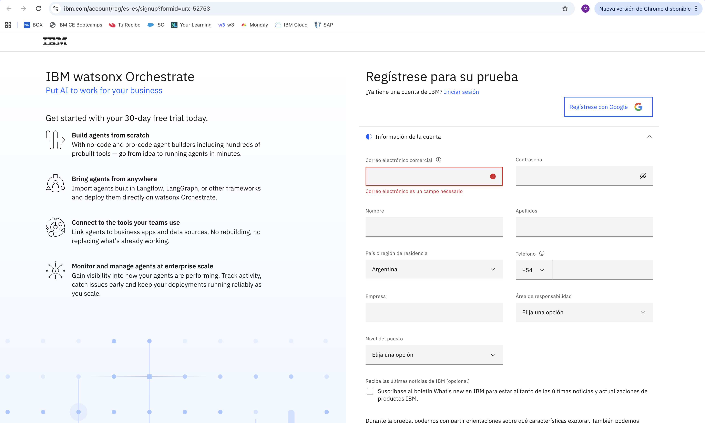
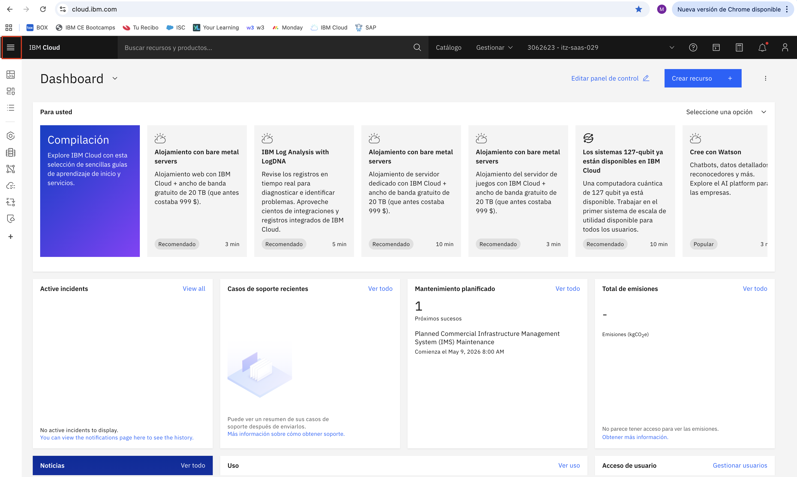
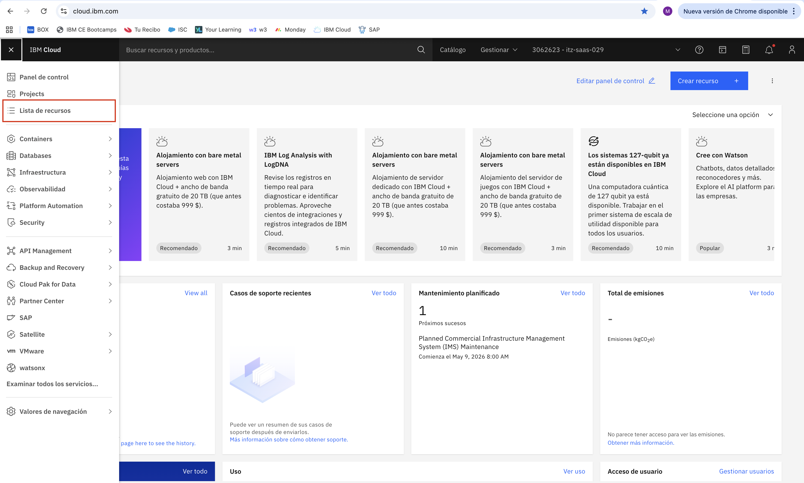
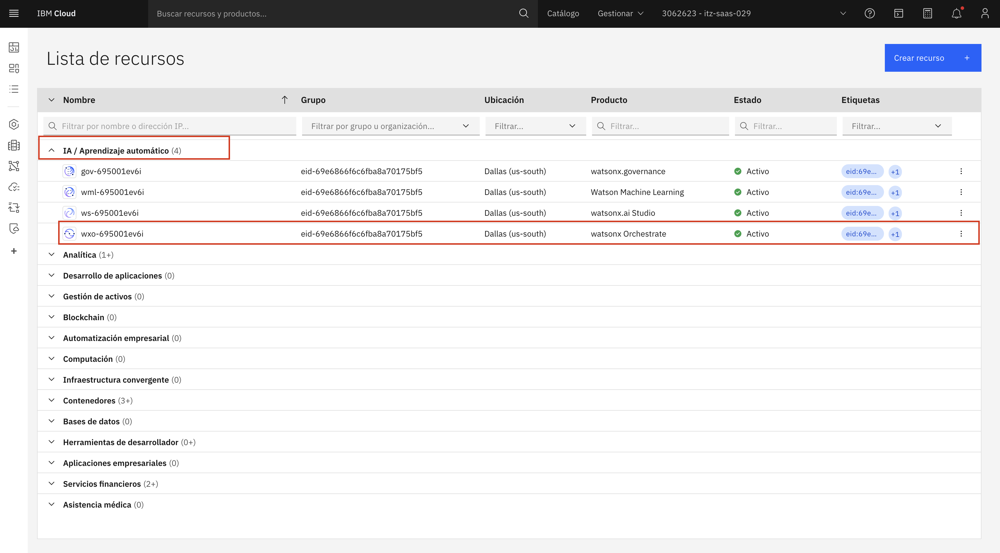
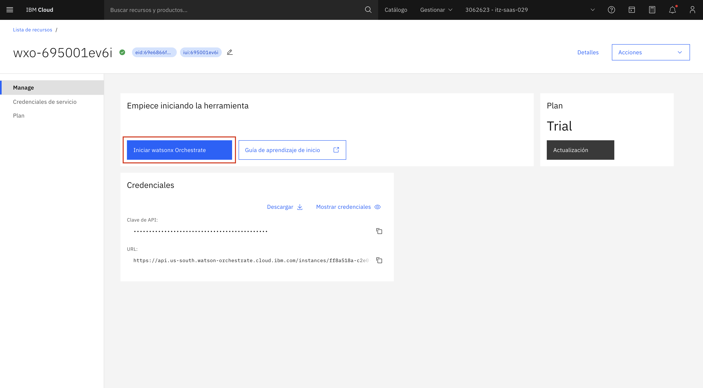

# Acceso a watsonx Orchestrate (Free Trial en IBM Cloud)

### Objetivo

En este laboratorio vas a crear tu cuenta en IBM Cloud y desplegar una instancia de prueba (*free trial*) de **watsonx Orchestrate**, que utilizaremos en los siguientes ejercicios.

---

## Prerrequisitos

Antes de comenzar, asegurate de contar con:

* Una dirección de correo electrónico válida de la UADE
* Acceso a tu casilla de email (para verificación)

---

## Paso 1: Registro en IBM Cloud

1. Accedé al siguiente enlace:
   👉 [Creación cuenta watsonx Orchestrate](https://www.ibm.com/account/reg/es-es/signup?formid=urx-52753)

2. Completá el formulario de registro con tus datos personales. Utilizá el mail de la UADE.

3. Hacé click en **Siguiente** para continuar.

---

## Paso 2: Verificación de la cuenta

1. IBM te enviará un código de verificación de 7 dígitos a la dirección de correo electrónico proporcionada.
2. Revisá tu bandeja de entrada. El correo puede tardar algunos minutos en llegar. Si no recibís el correo, verificá la carpeta de spam o correo no deseado.
3. En la pantalla de verificación, ingresá el código de 7 dígitos en el campo "Token de verificación".
4. Hacé click en "Enviar".

---

## Paso 3: Acceso a la herramienta

1. Una vez creada la instancia, accedé desde el dashboard de IBM Cloud:
   👉 [https://cloud.ibm.com](https://cloud.ibm.com)

2. Hacé click en el menú de hamburguesa.

3. Seleccioná **Lista de recursos**

4. Seleccioná la instancia de **watsonx Orchestrate** que acabás de crear.

5. Hacé click en **Iniciar watsonx Orchestrate**

---

## ¡Listo para comenzar!

Con estos pasos completados, ya tenés todo configurado para empezar a trabajar con watsonx Orchestrate. En los próximos ejercicios vas a explorar las capacidades de la plataforma y crear tu propio agente de IA.
